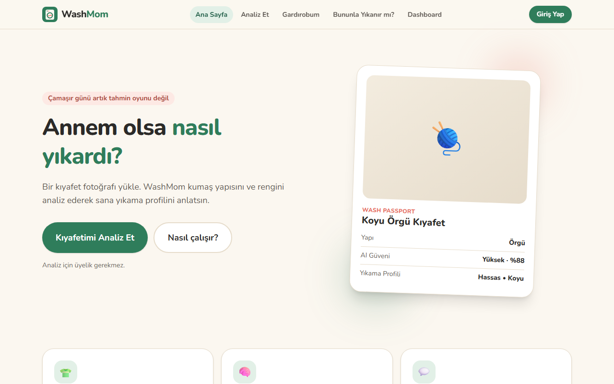
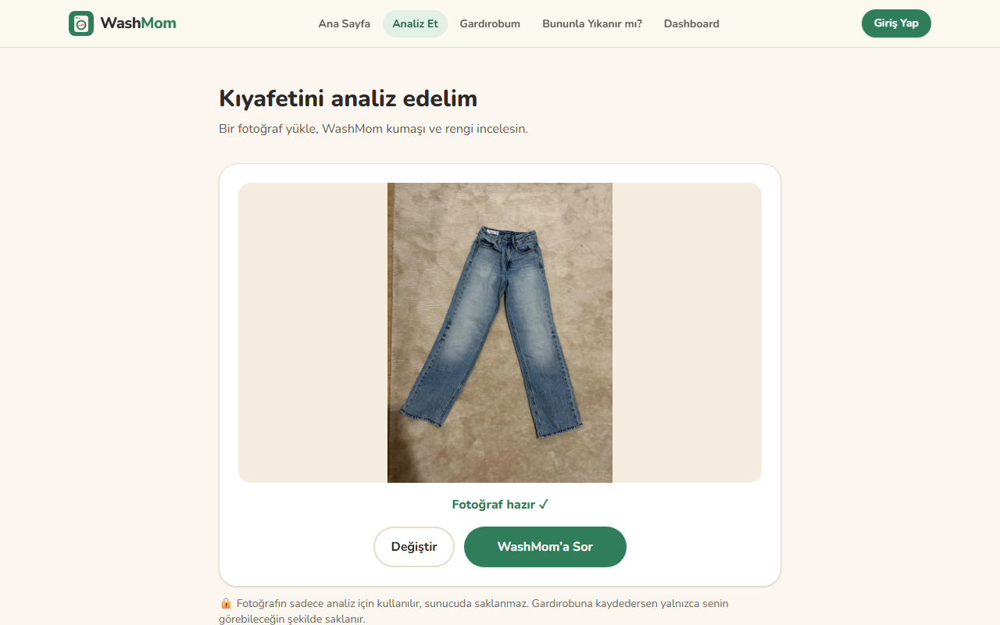
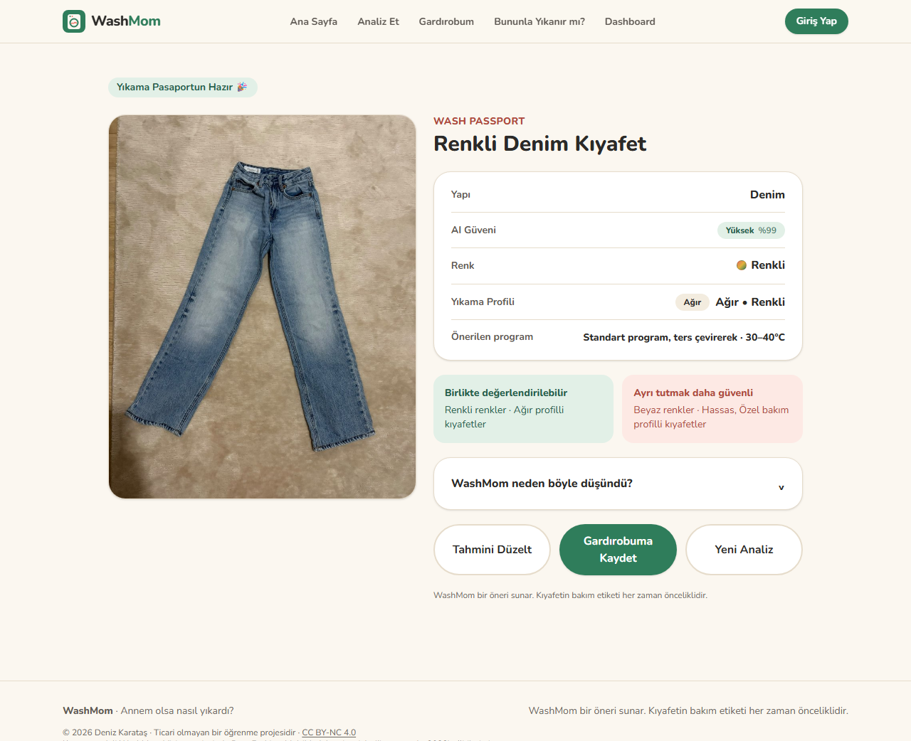
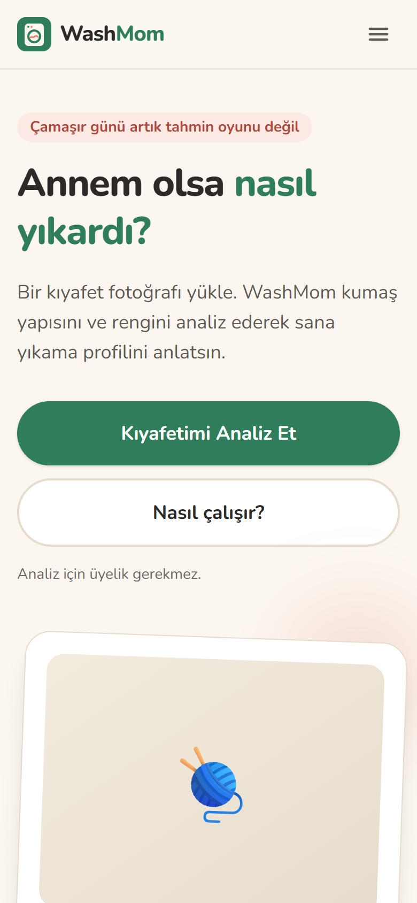
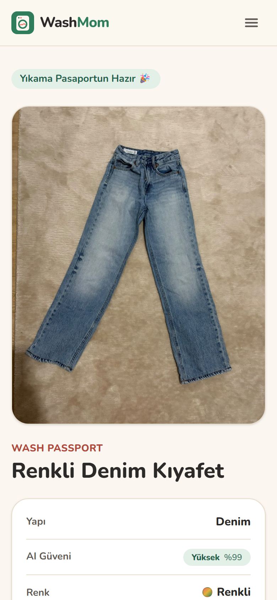

# WashMom Web

> "Annem olsa nasıl yıkardı?"

Tek bir kıyafet fotoğrafından **kumaş yapısını** (AI), **renk grubunu** (OpenCV) ve **yıkama profilini** (kural motoru) çıkaran web uygulaması. Analiz edilen kıyafetler **Gardırobum**'a kaydedilir. İki kıyafet seçilerek **“Bununla yıkanır mı?”** sorusu cevaplanır.

**Canlı demo:** https://washmom.netlify.app · **AI API:** https://washmom-api.vercel.app/docs

| Ana sayfa | Analiz | Wash Passport |
|---|---|---|
|  |  |  |

<p align="center">
  
  
</p>

> Ekran görüntüleri canlı siteden (https://washmom.netlify.app) gerçek modelle alınmıştır; örnek kıyafet kendi fotoğrafımızdır.

## Özellikler

- Fotoğraf yükleme (sürükle-bırak, mobilde kamera), tarayıcıda 1024 px'e küçültme
- AI kumaş tahmini + güven seviyesi; emin olunamadığında kullanıcıya sorma
- Kullanıcı düzeltmesi (kumaş ve renk); AI'ın orijinal tahmini ayrıca saklanır
- Supabase ile e-posta/şifre girişi; giriş, analiz sonucu kaybolmadan modal ile yapılır
- Gardırobum: kaydet, listele, ara, filtrele, düzenle, sil (fotoğraflar private bucket + signed URL)
- “Bununla yıkanır mı?”: iki kıyafetin renk / bakım / güven uyumluluğu
- Dashboard: renk, profil ve kumaş dağılımı (Recharts)
- Güvenlik: Row Level Security, her kullanıcı sadece kendi kayıtlarını ve fotoğraflarını görür

## Mimari

```
Kullanıcı → React (Netlify) ──→ FastAPI (Vercel): EfficientNetV2B0 (ONNX) + OpenCV
                            └──→ Supabase: Auth + Postgres (RLS) + Storage
```

| Parça | Görev |
|---|---|
| `frontend/` | React + Vite + Tailwind v4. Kural motorları (`src/rules/`) burada çalışır. |
| `backend/` | FastAPI. Sadece AI çıktısı üretir: kumaş, olasılıklar, renk, `needs_review`. Görsel saklamaz. |
| `supabase/schema.sql` | `garments` tablosu, trigger, RLS ve Storage policy'leri. |

Kural motorları frontend'dedir. Bu sayede kullanıcı tahmini düzelttiğinde profil anında yeniden hesaplanır. Aynı kurallar mock modda da çalışır.

## AI modeli

Kumaş modeli ayrı proje olan [WashMom Vision](https://github.com/denizkaratass/WashMom-Vision)'da eğitildi ve buraya **değiştirilmeden** alındı (`backend/model/effnet_sqrt_finetuned.keras`). Sunucu aynı ağırlıkları **ONNX** formatında çalıştırır (`effnet_sqrt_finetuned.onnx`). Bu sayede TensorFlow gerekmez ve backend ücretsiz sunucuya sığar; Keras ile fark 7,8e-7.

- EfficientNetV2B0 (fine-tuned), 6 sınıf: cotton, denim, chiffon, knitted, leather, furry.
- Test setinde Accuracy 0,831, Macro F1 0,730.
- Backend, P1'in pipeline'ını birebir uygular: 800 px → GrabCut ile kıyafeti ayırma → beyaz zeminli 224×224 crop → model → τ = 0.3 olasılık düzeltmesi.
- Renk grubu aynı GrabCut maskesindeki kıyafet piksellerinden (HSV) hesaplanır.
- Güven 0,55'in altındaysa (P1'de validation ile seçilen eşik) WashMom kumaşı kullanıcıya sorar.
- Fotoğrafta kıyafet bulunamazsa API `422` döner.
- Doğrulama: `backend/tests/golden/` içindeki 3 fotoğrafta backend, P1 ile aynı sonucu verir (`GoldenTests`).

## Hızlı başlangıç (sadece frontend, mock mod)

Gereken: Node.js 20+

```bash
cd frontend
npm install
cp .env.example .env      # VITE_USE_MOCK_API=true
npm run dev               # http://localhost:5173
```

Mock modda analiz sahte bir API ile çalışır: 1.5–2.5 sn gecikme, bazen belirsiz sonuç, bazen hata. Supabase ayarlanmadıysa giriş ve gardırop sayfaları bunu söyleyen bir mesaj gösterir.

```bash
npm test         # kural motoru + servis testleri (Vitest)
npm run build    # canlı için dist/ üretir
```

## Supabase kurulumu (giriş + gardırop)

1. [supabase.com](https://supabase.com) üzerinde yeni bir proje oluştur.
2. **SQL Editor** → `supabase/schema.sql` dosyasının tamamını yapıştır → **Run**. Bu adım tabloyu, RLS'yi, `garment-images` bucket'ını ve policy'leri oluşturur.
3. **Project Settings → API** sayfasından `Project URL` ve `anon`/`publishable` key'i `frontend/.env` dosyasına yaz:
   ```
   VITE_SUPABASE_URL=https://xxxx.supabase.co
   VITE_SUPABASE_ANON_KEY=eyJ...
   ```
   ⚠️ `service_role` / secret key **asla** frontend'e konmaz.
4. **Authentication → Sign In / Providers → Email**: geliştirirken **Confirm email** kapatılabilir. Kapalıyken kayıt olan kişi hemen giriş yapar. Açıkken önce e-postasındaki linke tıklaması gerekir; canlıda açık tutulması önerilir.
5. `npm run dev` komutunu yeniden başlat (`.env` değişiklikleri ancak yeniden başlatınca okunur).

**RLS testi:** İki farklı hesap aç, birine kıyafet kaydet. Diğer hesabın gardırobunda o kıyafet görünmemeli.

## Backend (FastAPI)

Gereken: Python 3.12+

```bash
cd backend
py -m venv .venv
.venv\Scripts\activate          # macOS/Linux: source .venv/bin/activate
pip install -r requirements.txt
uvicorn main:app --reload --port 8000
```

- `http://localhost:8000/health` → `{"status":"ok","model_loaded":true,"model_version":"effnet_sqrt_finetuned-v1"}`
- `http://localhost:8000/docs` → tarayıcıdan fotoğraf gönderip `/predict` endpoint'ini deneyebilirsin (ör. `tests/golden/kiyafet1.jpg`).
- Testler: `python -m unittest discover -s tests -v` (ek paket gerekmez; testler kendi sunucusunu açar; `GoldenTests` P1 ile karşılaştırır)
- Tahmin CPU'da ~3–6 sn sürer (en yavaş adım GrabCut).

Frontend'i bu backend'e bağlamak için `frontend/.env` içinde `VITE_USE_MOCK_API=false` yap ve `npm run dev` komutunu yeniden başlat. Model dosyaları hakkında: [`backend/model/README.md`](backend/model/README.md)

## Deployment

**Frontend (Netlify):** Repo kökündeki `netlify.toml` ayarları hazırdır (base `frontend`, build `npm run build`, publish `dist`). Ortam değişkenleri Netlify panelinden girilir. `public/_redirects` sayfa yenilemede 404 alınmasını önler.

**Backend (Vercel, ücretsiz Hobby planı, kart gerekmez):** Vercel'de aynı repodan yeni bir proje aç, **Root Directory** = `backend` seç (`main.py` içindeki FastAPI `app` otomatik bulunur). Ortam değişkeni olarak `ALLOWED_ORIGINS` = Netlify adresi gir. Frontend'de `VITE_API_URL` değerini Vercel adresi yap. Ayrıntılar: [`backend/README.md`](backend/README.md). (Başka bir sunucu için `backend/Dockerfile` da hazır.)

**Supabase:** Authentication → URL Configuration → Site URL ve Redirect URL'lere canlı Netlify adresini ekle.

> ⚠️ Supabase'in ücretsiz planı bir hafta kullanılmayan projeleri **duraklatır**. Duraklatılan projede giriş ve gardırop çalışmaz (analiz çalışmaya devam eder). Dashboard'dan **Restore project** ile tekrar açılır. Teslim ve sunum öncesinde kontrol et.

**Güvenlik başlıkları:** `frontend/public/_headers` Netlify'a clickjacking, MIME sniffing ve referrer korumalarını ekler.

**CI:** `.github/workflows/ci.yml` her push'ta frontend lint + test + build ve backend testlerini çalıştırır.

## Proje yapısı

```
frontend/src/
  components/   Navbar, UploadBox, WashPassport, CorrectionPanel, GarmentCard, modallar...
  pages/        Home, Analyze, Result, Login, Register, Wardrobe, GarmentDetail, Compare, Dashboard, NotFound
  context/      AuthContext (oturum), AnalysisContext (son analiz)
  services/     api.js (mock/gerçek seçimi), mockApi.js, supabase.js, garmentService.js, storageService.js
  rules/        washingRules.js, compatibilityRules.js, rules.test.js
  constants/    labels.js (Türkçe etiketler, eşikler)
  utils/        resizeImage.js (canvas ile 1024 px'e küçültme)
backend/
  main.py  inference.py  preprocessing.py  color_analysis.py  schemas.py  config.py
supabase/schema.sql
```

## Lisans

[CC BY-NC 4.0](LICENSE): ticari olmayan amaçlarla atıf vererek kullanılabilir. Kumaş modeli DeepFashion-MultiModal veri setiyle eğitildiği için uygulama **ticari olarak kullanılamaz** (reklam, ödeme, ücretli hizmet yok). Telif, model ve veri seti notu: [NOTICE](NOTICE).

---

WashMom bir öneri sunar. Kıyafetin bakım etiketi her zaman önceliklidir.
